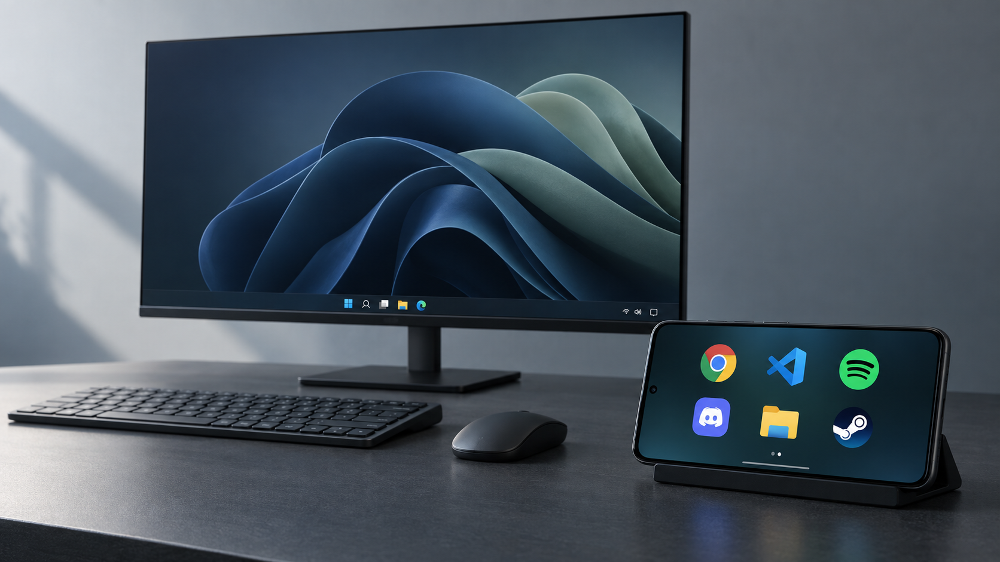

# WinDock

A remote app dock and control surface for a Windows PC, driven from a phone on
the same network. Pin your apps as tiles, tap to launch or focus them, and drive
volume, media, brightness and power without getting up.

[Website and interactive demo](https://windock.vercel.app) ·
[Downloads](https://windock.vercel.app/#download)



*WinDock at your desk — an AI-generated product illustration.*

## Status

Continued on Windows on 2026-09-17. **16 verification scripts and 930 assertions
pass**, and the C# helper and tray now compile and run. Native checks verified
argument-preserving launch, window enumeration, focus, polite close, Core Audio
at the existing volume, and the now-playing command. A desktop browser verified
pairing, live sync and tile editing against the PC's LAN address.

**17 of 18 gates are met.** G14 still requires a real Android phone to launch and
focus an app on this PC. The Android debug APK now builds and passes its four
Kotlin unit tests and an Android 16 emulator flow for pairing, live sync,
fullscreen, swipes, editing, action requests and reconnection.
Physical media-key effects remain unverified. External-monitor brightness was
verified on the Samsung LC34G55T through the live Windows API, with the original
level restored after the check.
The latest native smoke rerun also fails at window focus with both old and new
helpers; earlier runs passed. This is tracked separately from the glass UI.

See [ROADMAP.md](ROADMAP.md) for the next step and
[WINDOWS_READINESS.md](WINDOWS_READINESS.md) for audit and verification evidence.

## Your dock

Use the phone in landscape. Immersive mode opens to only large icons over an
abstract background, with no title, top bar, toolbar, or app names. Apps show
their real Windows icons extracted at 256px, including
custom shortcut resources when available. Missing artwork gets a neutral icon.

The app library includes classic Start Menu shortcuts and packaged Windows
apps, including Claude, ChatGPT, and ChatGPT Classic. Packaged apps use their
Windows app identity for icons, launch, and activation, so app updates do not
break pinned tiles by changing the executable's versioned path.

- Hold an icon or empty dock space to enter edit mode; icons gently jiggle.
- Drag to rearrange. Hold near the left/right edge to move between pages.
- Tap an icon while editing for remove/move options. Tap the checkmark to finish.
- Swipe left/right to change pages. Page dots also work as buttons.
- Swipe up to reveal the glass drawer: Apps, Controls, Capture, Appearance, Arrange,
  and Fullscreen. Swipe down from the drawer handle to close it.
- Appearance offers exactly 4, 6, or 8 icons per page (2×2, 3×2, or 4×2).
  Icons scale with the selected density and available screen space.
- Choose Aurora, Dusk, Ember, or Midnight backgrounds and Clear, Frosted, or
  Smoked glass. App names and the previous non-immersive mode are optional.
- Open Apps in the drawer to search and pin multiple apps or controls.
- Open Capture for a full-resolution PNG screenshot or a silent MP4 recording
  of the main monitor. Files stay on the PC in `Pictures\WinDock` and
  `Videos\WinDock`. Recordings fit within 1920×1080 at up to 15 fps, preserve the
  monitor's aspect ratio, and stop after 60 minutes. Tap the recording timer's
  Stop button, or use **Stop recording** in the Windows tray. The tray's
  **Open captures** menu opens either folder. This first version has no audio
  or cursor overlay; protected video may appear black. No extra encoder install
  or Android app update is required.

Layout and appearance preferences stay on each device. Pinned tiles and their order sync
through the PC. Fullscreen requests landscape where supported; ordinary phone
browsers may require rotating the device manually. These touch gestures still
need physical-phone acceptance after this redesign.

## How it works

```
   phone / browser                         Windows PC
 ┌──────────────────┐                 ┌──────────────────────┐
 │  PWA (installed) │◀── WebSocket ──▶│  Node host           │
 │  tiles + control │    snapshots    │   ├ HTTP API (PIN)   │
 └──────────────────┘                 │   ├ UDP discovery    │
          ▲                           │   └ platform provider│
          └──── UDP probe ────────────│         │            │
             "where is the dock?"     │         ▼            │
                                      │  WinDockHelper.exe   │
                                      │  (Win32: focus,      │
                                      │   media keys, volume)│
                                      └──────────────────────┘
```

1. The host serves the PWA and owns all dock state.
2. A phone finds the host by UDP broadcast — no typing IP addresses.
3. Pairing takes one 4-digit PIN; sessions last until host restart or their 180-day expiry.
4. Tapping a tile calls the authenticated API, which delegates to the provider.
5. Tile edits and app actions through WinDock broadcast a snapshot to connected devices.

## Design decisions worth knowing

**Nothing ever reaches a shell.** `execFile` is called with an argv array and
`shell: false`. A path containing `& shutdown /s /t 0` is one opaque argument,
never a second command. `verify-injection.mjs` proves this with ten payloads,
each paired with a positive control that must be caught by the same detector.

**Read-only PowerShell is constant.** Inventory and telemetry run fixed scripts
with no interpolation; the injection gate greps the source to prove no template
literal ever enters one.

**Actions go through a helper binary.** Win32 P/Invoke (`SetForegroundWindow`,
media keys, Core Audio, WMI/DDC-CI brightness, media transport controls) lives in
`WinDockHelper.exe` behind an argv interface. That keeps the Node side pure and
testable on any OS — which is why the Windows logic is verifiable here at all.

**A real Linux provider ships alongside Windows.** `src/platform/linux.js` is a
working provider, not a stub, so the whole stack runs and is tested on a dev
machine instead of being Windows code nobody has executed.

**Close asks, never kills.** `WM_CLOSE` lets an app prompt to save. Losing
unsaved work to a phone tap is not an acceptable failure mode.

**Valued controls carry their value.** `volume-set` and `brightness-set` need a
number, so their tiles store one ("Volume 25%", "Brightness 50%") and are keyed
by verb *and* value. A control tile for a valued verb with no value is rejected
by the host rather than producing a tile that fails on every tap.

**The service worker never caches live state.** Everything under `/api/` is
network-only. Caching dock state could show a stale running badge or, far worse,
replay a control action from cache.

## Run it

For the standalone product website, build the Windows installer and Android
APK, run `npm run package:downloads`, then `npm run website` and open http://127.0.0.1:4173.
This is a local review site with working preview downloads; it does not publish
anything or operate the live dock. See [website/README.md](website/README.md).

```sh
npm install
npm start
```

The host prints its LAN URL and PIN. Open the URL on your phone and enter the
PIN. On Linux it runs with the Linux provider; on Windows it selects the Windows
provider automatically.

```sh
npm test        # all 16 verification scripts
```

Swipe up and open **Apps** to pin apps or controls. Hold an icon to rearrange
or remove it.

### Build the Windows installer

Run `npm run build:windows`, then `npm run build:installer` with Inno Setup 7
installed (or in `.tools/innosetup7`). This produces
`artifacts/installer/WinDockSetup.exe`. Users open this one file; setup installs
the runtimes, creates a Start menu entry, and provides an uninstaller. Desktop
shortcut and sign-in startup are optional. Personal dock settings are kept
separately and preserved across upgrades/uninstall. `npm run test:installer`
verifies installation, bundled-host startup, reinstall, and uninstall in an
isolated workspace folder; it refuses to replace an existing installed copy.

The GitHub **Build WinDock downloads** workflow builds both platforms. Manual
runs can create a draft release with direct download assets and a website
manifest. Public downloads require a public release destination; the repository
is currently private. Nothing has been pushed or published during local review.

### Build and run the portable Windows package

With a .NET 8 SDK on PATH or in the project's ignored `.tools/dotnet` folder:

```powershell
npm run build:windows
npm run test:windows
```

Run `artifacts\WinDock-win-x64\WinDockTray.exe`. The folder contains the
self-contained helper/tray, Node, server, web assets and ws dependency. The tray
shows the LAN URL and pairing PIN and stops its server when you quit it.
The build also copies the helper to the repository root for `npm start`.

The host prefers physical LAN adapters over VPN/VM adapters. To select another
local IPv4 address, set `WINDOCK_HOST` before starting it. For a different
helper location, use `WINDOCK_HELPER`. An invalid/unassigned host address is rejected.

Shortcut argument strings are preserved. Distinct shortcut profiles/modes have
separate tile IDs; these tiles launch their requested mode each time because an
executable path alone cannot identify the correct running profile to focus.

Brightness uses WMI for built-in panels and DDC/CI for supported HDMI/DisplayPort
monitors, including a VCP luminance fallback. It adjusts the controllable displays
and maps percentages to each monitor's reported range. Enable DDC/CI in the
monitor's own menu if required; some picture modes or connections can block it.
Unsupported or rejected changes show an explanation on the phone.

Read support/current levels with `WinDockHelper.exe brightness`. An explicit
hardware check is available as `node scripts/smoke-brightness.mjs`, or add
`--base-url http://127.0.0.1:8620` to check the running host's API. It requires
one controllable display, tests a five-point change, and restores the original
level in a `finally` block. It is intentionally separate from `npm test`.

### Build the Android app

With Android Studio's JDK and Android SDK Platform/Build Tools 34 installed:

```powershell
npm run build:android
```

This builds, runs Kotlin tests and lint, verifies the APK signature, and writes
`artifacts/WinDock-android-debug.apk`. The Gradle 8.9 wrapper is included with an
official distribution checksum. The build script finds Android Studio's JDK
and SDK automatically, or accepts `JAVA_HOME` / `ANDROID_HOME`.

Install the APK on the phone and keep the PC tray running. Both devices must be
on the same LAN. The app finds the PC automatically, or accepts its tray URL in
the connection screen. Enter the PC's PIN in the shared interface. Android Back
closes the current sheet, then returns to PC selection. The app always opens in
landscape and hides system bars; Android can reveal them temporarily by swiping
from an edge. This is a debug build for private testing, not a signed release.

See [android/README.md](android/README.md) for installation and emulator checks.

The app is a thin WebView host: it finds the PC by UDP broadcast, remembers the
endpoint, and loads the same PWA. It never handles the PIN or session cookie —
pairing stays inside the WebView, and `G17` asserts that boundary in code.
LAN HTTP is enabled at the Android transport layer because domain rules cannot
represent dynamic subnets. Kotlin validates private/loopback IPv4 endpoints and
restricts WebView navigation and intercepted requests to the selected origin.
DNS names other than localhost and IPv6 endpoints are not supported in this build.

The web interface can be used online without an APK. Service workers and the
offline shell require a secure origin (HTTPS or localhost); plain HTTP on a
phone-accessible LAN IP does not meet that requirement.

## Security boundary

- All `/api/*` routes require a PIN-issued session. `/health` is the only public
  route.
- PIN comparison is constant-time; 5 failures lock a client out for 60 seconds.
- Session cookies are `HttpOnly`, `SameSite=Lax`, and `Secure` over HTTPS.
- State-changing requests and WebSocket upgrades are same-origin checked, so a
  hostile page cannot ride a paired session.
- Loopback is trusted by default so the host's own tray needs no pairing. Set
  `trustLoopback: false` to require pairing even on the host.
- Discovery replies advertise only the endpoint — never the PIN.

WinDock is designed for a home LAN. Do not expose the port to the internet: a
4-digit PIN is appropriate for a local network, not a public one.

## API

| Method | Path | Purpose |
|---|---|---|
| GET | `/health` | Public health check |
| POST | `/api/auth` | Exchange the PIN for a session |
| GET | `/api/state` | Tiles, running apps, available verbs |
| GET | `/api/apps/installed` | Full installed-app inventory |
| GET/PUT | `/api/tiles` | Read or replace the pinned tiles |
| POST | `/api/apps/launch` | Launch an app by id |
| POST | `/api/apps/focus` | Focus a running pid |
| POST | `/api/apps/close` | Ask a running pid to close |
| POST | `/api/control` | Run a control verb |
| GET | `/api/nowplaying` | Current media session |
| GET | `/api/stats` | CPU, memory, battery |
| GET | `/api/capture` | Recording phase, elapsed time, last saved file |
| POST | `/api/capture/screenshot` | Save the main monitor as PNG |
| POST | `/api/capture/start` | Start one silent MP4 recording (idempotent) |
| POST | `/api/capture/stop` | Stop and finalize the current recording |

Capture actions accept an empty JSON object, require pairing (or trusted
loopback), and use the same origin checks as other actions. Clients cannot
choose output paths or execute encoder arguments. Saved media is not served
over HTTP. `node scripts/smoke-capture.mjs` is an explicit hardware check that
creates a screenshot and a short recording; it is never part of `npm test`.

## Control verbs

`volume-up` `volume-down` `volume-set` `mute-toggle` `media-play-pause`
`media-next` `media-previous` `media-stop` `brightness-set` `lock` `sleep`
`shutdown` `restart`

`volume-set` and `brightness-set` take an integer 0–100. Every verb is matched
against a fixed allowlist before it can reach a command line.

## Layout

```
server.js              HTTP API, static serving, wiring
src/platform/          contract + windows + linux providers
src/auth.js            PIN, sessions, lockout
src/config.js          tile persistence (atomic writes)
src/discovery.js       UDP responder
src/sync.js            WebSocket hub
public/                PWA — dock.js and tiles.js are pure and headlessly tested
public/sw.js           service worker (shell cached, /api never cached)
android/               Kotlin WebView wrapper (discovery + endpoint memory)
native/win/            WinDockHelper — Win32 surface
native/tray/           WinDockTray — system tray host
scripts/verify-*.mjs   the gate oracles
GATES.md               acceptance ledger
```
